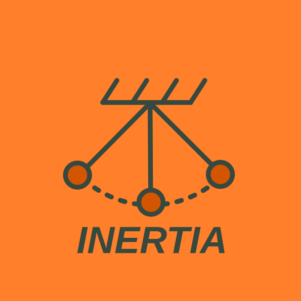
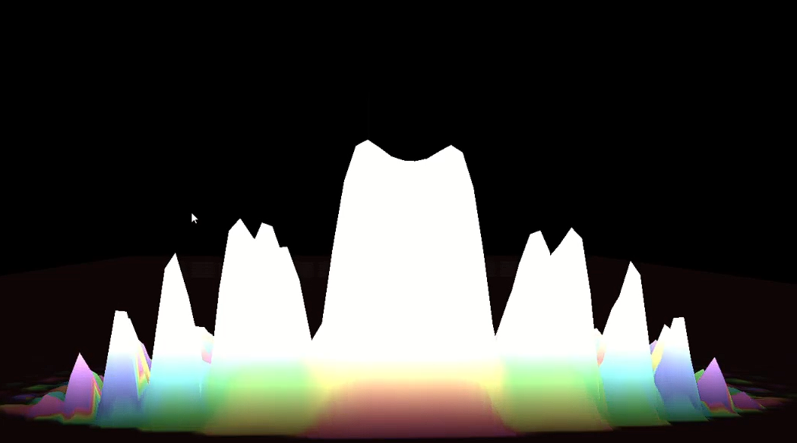

# Inertia - Quantum Mechanics Simulator

A GPU-accelerated quantum mechanics simulator implementing the Schrödinger equation in 2D, built with Rust and OpenGL compute shaders.

## Abstract

This project presents a GPU-accelerated framework for solving the 2D Time-Dependent Schrödinger Equation (TDSE) in real-time. By leveraging OpenGL Compute Shaders, the system achieves interactive visualization of quantum phenomena such as wave packet evolution, tunneling, and interference. The study compares three numerical integration methods—Forward Euler, Runge-Kutta 4 (RK4), and Leapfrog—analyzing their performance in terms of numerical stability, unitarity preservation, and computational efficiency.

## Features

- **Real-time quantum wave evolution** using three numerical methods:
  - **Euler Method** - Simple first-order integration
  - **Runge-Kutta 4 (RK4)** - Fourth-order accuracy
  - **Leapfrog Integration** - Symplectic time-stepping with alternating updates
  
- **Quantum phenomena simulation**:
  - Wave packet propagation
  - Quantum tunneling through potential barriers
  - Double-slit interference patterns
  - Unitarity tracking for numerical stability

- **Interactive visualization** with real-time 3D rendering
- **Image export** for wavefunction, probability density, and amplitude
- **GPU compute shaders** for high-performance parallel computation

## Screenshots

### Interference Pattern

### Simulation Examples

| Double Slit (Euler) | RK4 Simulation | Leapfrog Integration |
|:---:|:---:|:---:|
|  |  |  |

## Physics Implementation

The simulator solves the time-dependent Schrödinger equation:

$$i\hbar \frac{\partial \psi}{\partial t} = \hat{H}\psi = \left(-\frac{\hbar^2}{2m}\nabla^2 + V\right)\psi$$

Uses Gaussian wave packets with customizable momentum and spatial width, with potential barriers defined via texture maps for flexible geometry.

## Numerical Methods Analysis

The simulator implements and compares three distinct integration schemes:

| Method | Order | Stability | Unitarity | Description |
| :--- | :--- | :--- | :--- | :--- |
| **Forward Euler** | 1st | Low | Poor | Simple explicit update. Generally unstable for the Schrödinger equation without extremely small time steps, leading to rapid divergence. |
| **Runge-Kutta 4 (RK4)** | 4th | High | Good | Calculates 4 intermediate slopes per time step. Offers high accuracy and stability but is computationally expensive. |
| **Leapfrog** | 2nd | Medium | Excellent | A symplectic integrator that updates Real and Imaginary parts in alternating time steps. Preserves phase space volume, making it superior for long-term conservation. |

## Technical Implementation

- **GPU Acceleration**: Utilizes massive parallelism to update a 256x256 grid (65,536 points) in real-time.
- **Memory Management**: Uses `RG32F` textures for high-precision floating-point storage and "ping-pong" buffering to handle read/write dependencies during time evolution.
- **Visualization**: Maps the complex wavefunction $\psi(x, y)$ to a high-resolution 3D mesh where height represents amplitude and color represents phase.

## Unitarity Check

The simulator tracks total probability conservation: $\int |\psi|^2 dx$ should remain ≈ 1.0 throughout evolution.

<!-- Add simulation examples/GIFs here -->

## Learn More

- **Blog**: [Blog Link](https://madebydaris.github.io/posts/inertiaquant11-23-2025/)
- **Research Paper**: [Numerically Solving the Time-Dependent Schrödinger Equation: Analysis of Unitarity, Stability, and Real-Time GPU Implementation](https://www.researchgate.net/publication/398537007_Numerically_Solving_the_Time-Dependent_Schrodinger_Equation_Analysis_of_Unitarity_Stability_and_Real-Time_GPU_Implementation?channel=doi&linkId=6939ea1ea1fd01798906c0ba&showFulltext=true)

## Note

This repository contains legacy code from the **Orbital-Mechanics** branch of the project. Feel free to explore the previous work on gravitational N-body simulations!

## Built With

Rust • OpenGL Compute Shaders • glium • egui

---

*For technical details and derivations, check out the blog post and paper linked above.*
